# Cluster 생성
## Clouster Role
cluster 명을 기재 하고 role을 설정한다 
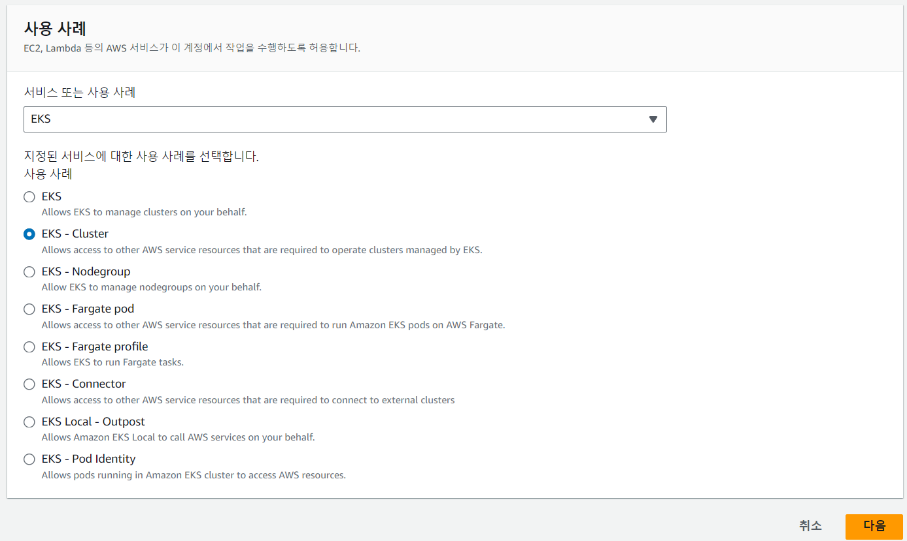
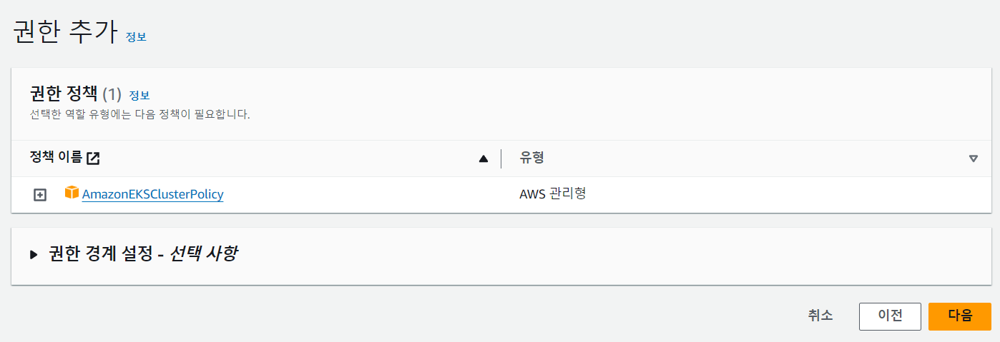
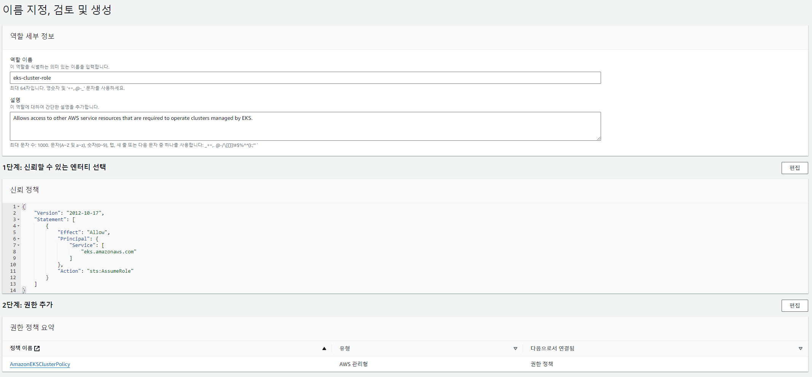
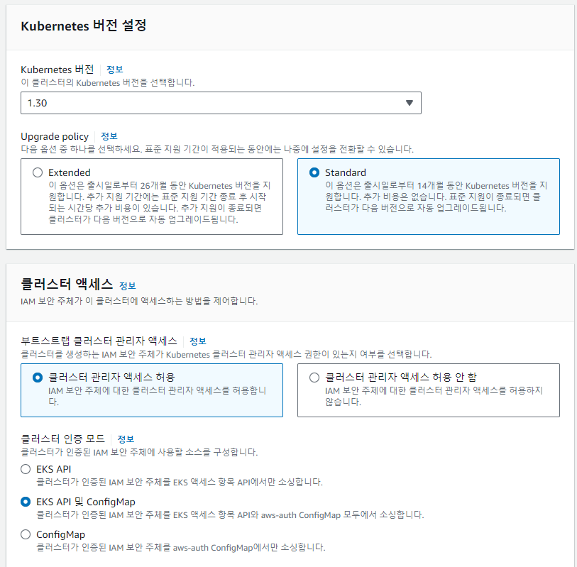
> EKS에서 role 설정은 매우 중요 하다 . \
> 기본적으로 EKS의 role은 3가지가 있다. 
```
1. Cluster Role  
2. Node Role
3. Sa Role(ServiceAccount)
 
ClusterRole은 한번 쓰고 다시는 안쓰일거라서 default로 생성하고 이후에는 다시 사용 할 일이 없을 것이다. 
하지만 NodeRole과 SaRole은 지속적으로 권한 변경이 필요 할 수 있음으로 수작업으로 생성 해야 한다
```

---
## Network
> Private 환경임을 고려 하여 클러스터는 내부에서만 접속 할 수 있도록 \
> 서브넷과 엔드포인트 엑세스를 프라이빗으로 선택한다.


## Add On
> 기본이자 필수인  addon이다 여기서 체크를 안하게 되면 수동으로 설치해야 하니 무조건 체크 하자
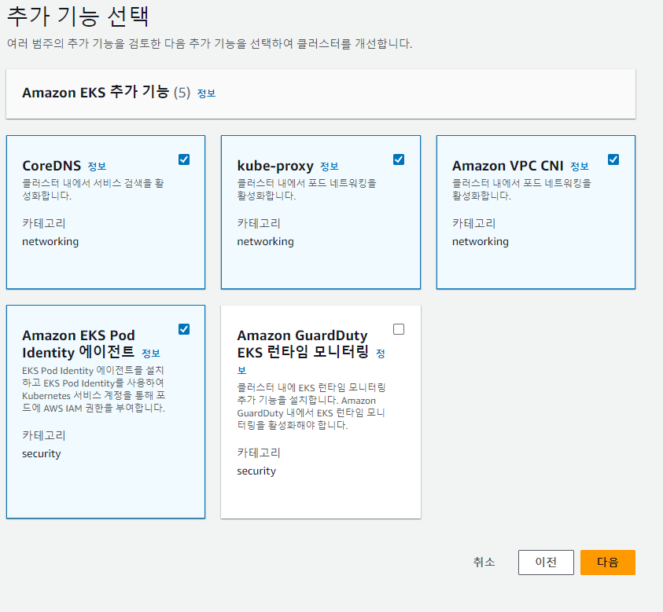
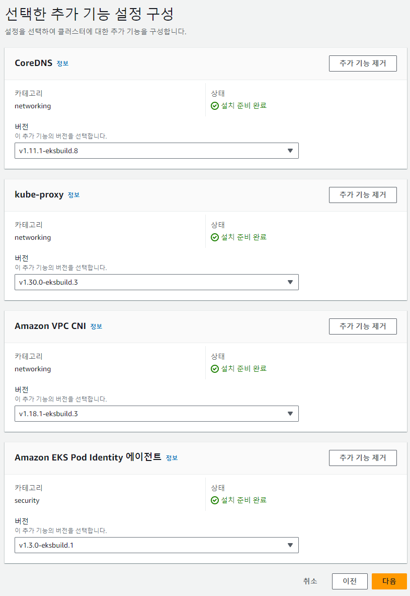

## 클러스터 생성확인
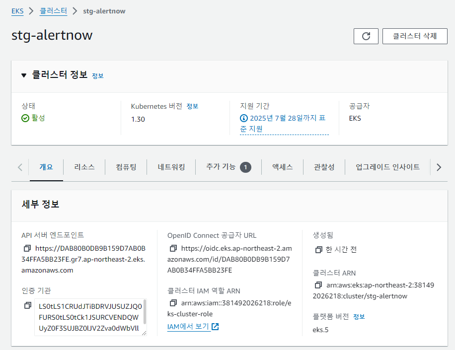

## IAM 대상 추가
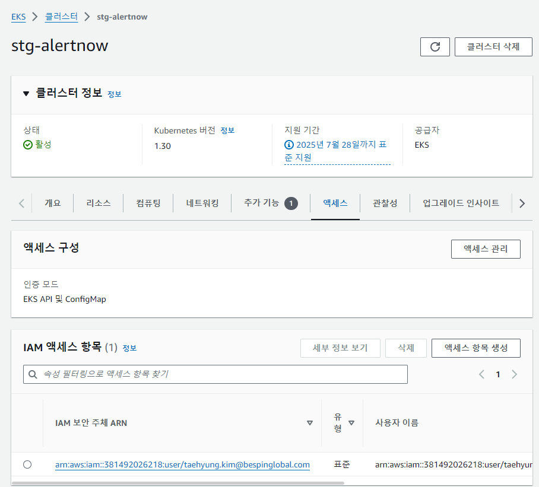

### 엑세스항목 생성
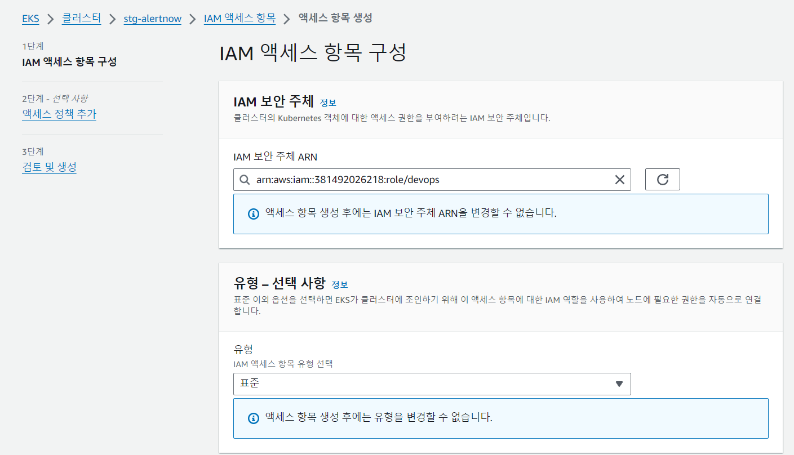
role을 추가한다
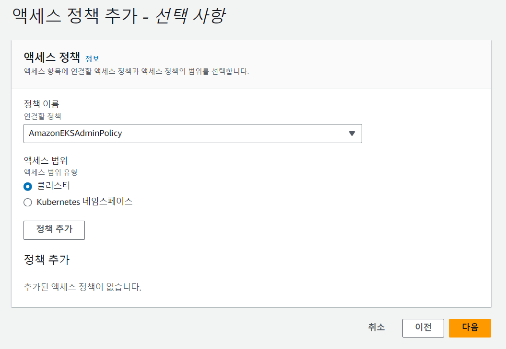
사용자를 한번 더 추가한다
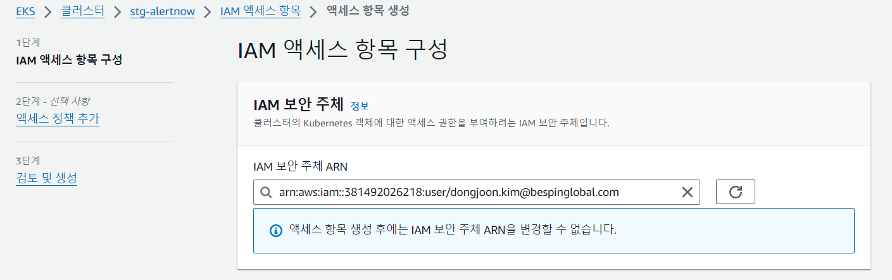


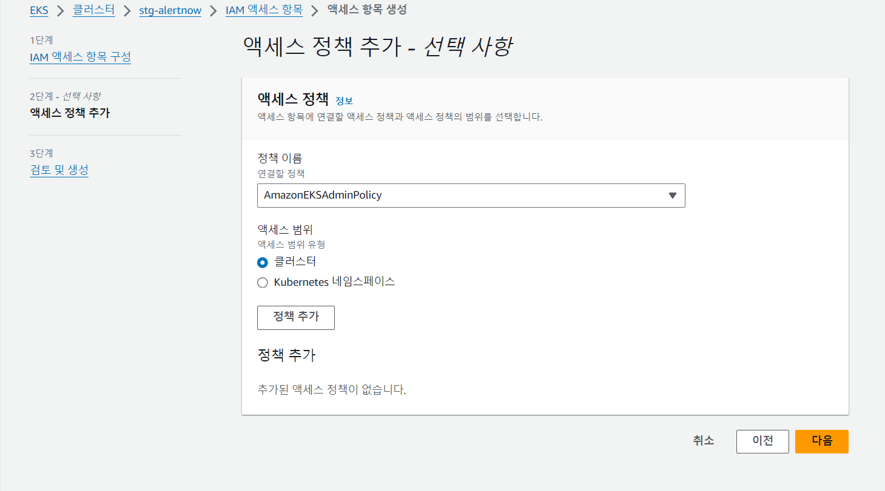


user와 role을 추가 하였다면 cluster 에 접속을 해보자
``` 
export Cluster_Name=stg-alertnow
eksctl utils write-kubeconfig --cluster=${Cluster_Name}

2024-08-05 17:40:06 [✔]  saved kubeconfig as "/home/kth/.kube/config"

pod를 test 해보자
❯ k get po -A
E0805 17:50:05.653051   55531 memcache.go:265] couldn't get current server API g
roup list: Get "https://DAB80B0DB9B159D7AB0B34FFA5BB23FE.gr7.ap-northeast-2.eks.
amazonaws.com/api?timeout=32s": dial tcp 10.0.154.131:443: i/o timeout

```

당연히 안될 것이다. 네트워크 주소 해석이 안되기 때문이다

bastion hosts를 이용하자

```
❯ k get po -A
NAMESPACE     NAME                      READY   STATUS    RESTARTS   AGE
kube-system   coredns-5b9dfbf96-ccjdl   0/1     Pending   0          42h
kube-system   coredns-5b9dfbf96-d48pd   0/1     Pending   0          42h
```


클러스터를 pod 상태를 조회 하였지만 Pending 상태이다. \
클러스터만 생성 하였기 때문에 실제 서버인 node가 없어 pod를 띄울 물리적인 서버가 없기 때문이다. \
다음 장에서  node를 추가를 다루겠다.
