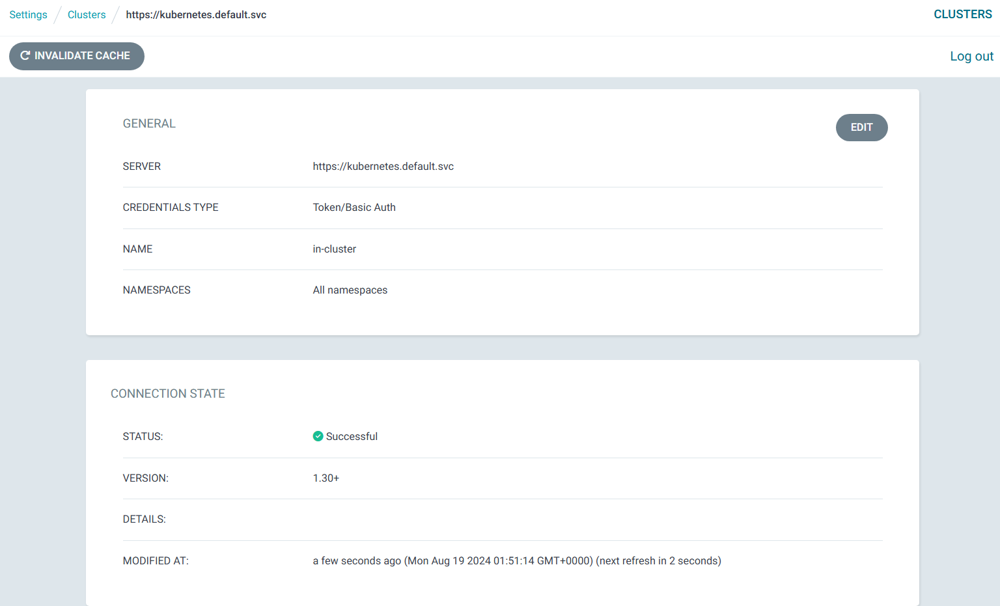
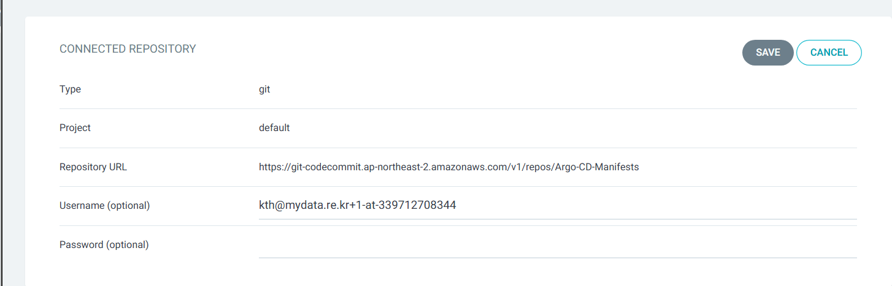
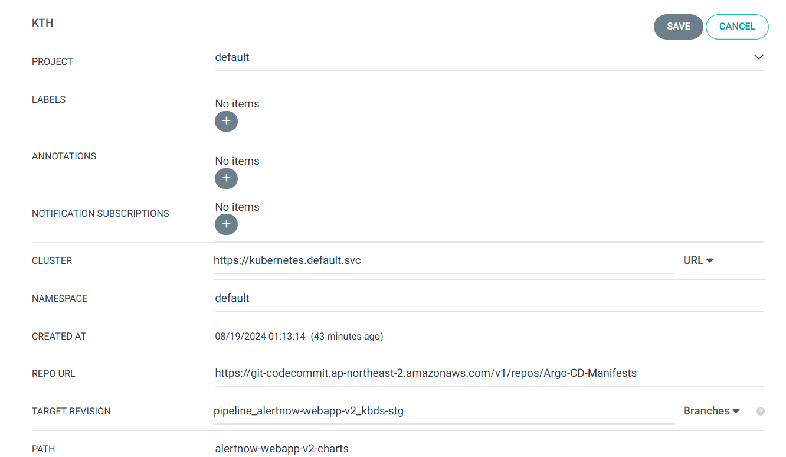
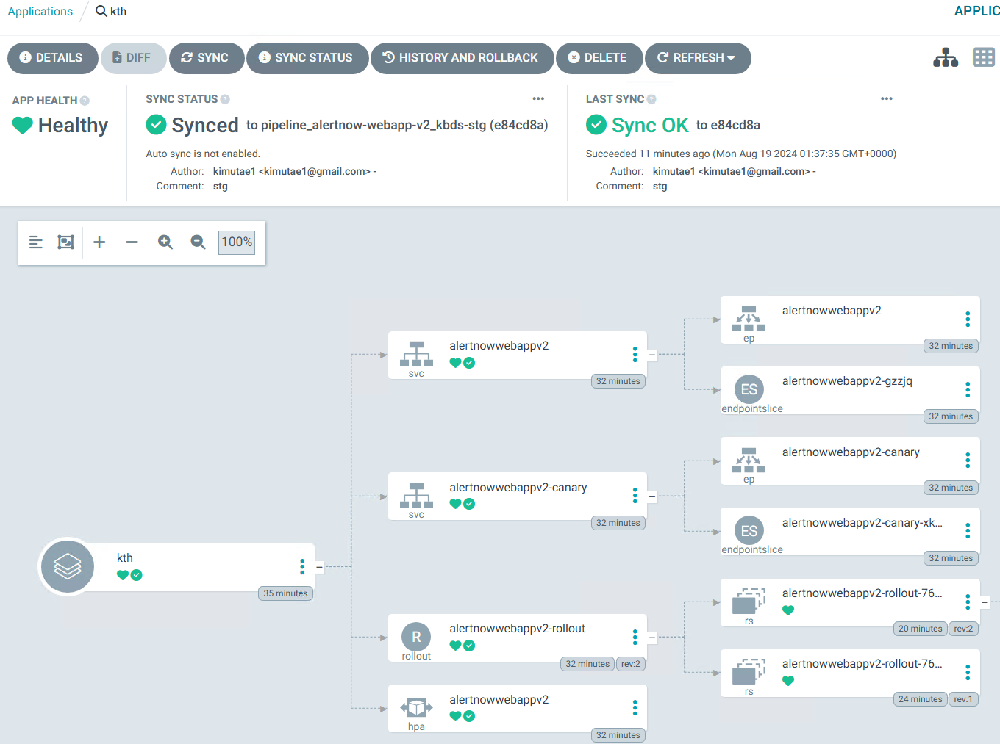

## cluster setting 
같은 cluster 내에 argocd가 있기 때문에 기본 클러스터로 지정 하여도 문제가 없다.\
만약 다른 클러스터에 배포를 하게 될 경우 OIDC 설정 부터 해서 추가 작업을 진행 해줘야 한다.\
난이도가 많이 올라가니 가능하면 같은 클러스터를 이용 하도록 한다.




## repo setting 
repo url 과 credential 을 입력 한다.
고객사의 경우 ssh 제약으로 인하여 https 방식으로 설정 하였으나 가능하면 ssh 방식을 더 추천 한다. \
상황에 맞게 잘 선택 하자

```
settings -> repository -> connect repo
https://git-codecommit.ap-northeast-2.amazonaws.com/v1/repos/Argo-CD-Manifests
username : kth@mydata.re.kr+1-at-339712708344
```




## Appliaction setting
 클러스터 와 repo를 잘 셋팅 하였다면 그 다음 어플리케이션을 하나씩 셋팅 하도록 한다. \
 targetRevision과 path , valueFiles 를 잘 설정 하면 된다. \
 타입을 헬름으로 지정 할 경우에 valueFiles 를 지정 안했다면 values.yaml 이 기본 값이 된다.
 

```
project: default
source:
  repoURL: >-
    https://git-codecommit.ap-northeast-2.amazonaws.com/v1/repos/Argo-CD-Manifests
  path: custom-webapp-v2-charts
  targetRevision: pipeline_custom-webapp-v2_kbds-stg
  helm:
    valueFiles:
      - values-stg.yaml
destination:
  server: https://kubernetes.default.svc
  namespace: default
```




## 배포 완료 




