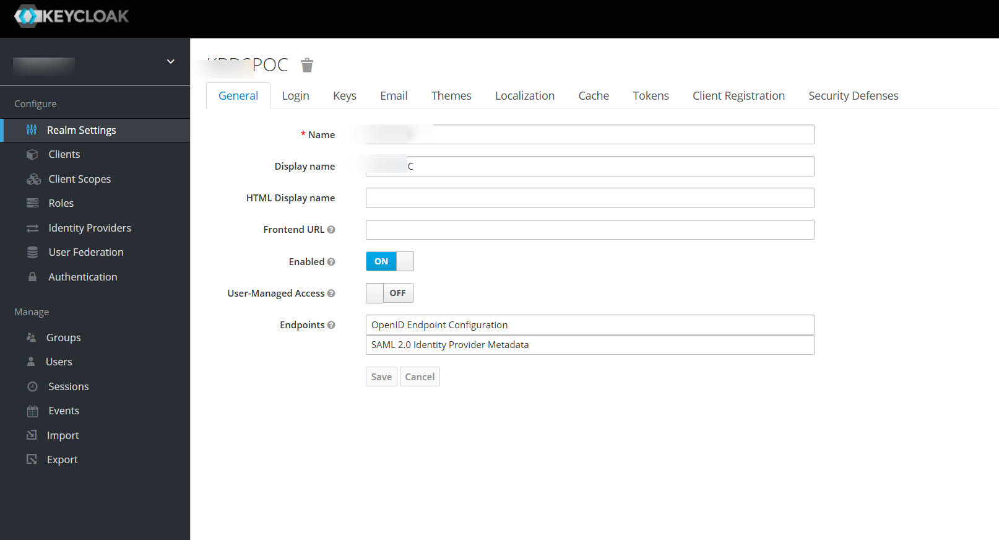

portal 같은 경우 크게 keyclock을 base로 하며 api / admin 등으로 구성되어 있다.

기존에는 ecs로 구성되어 있었으나 eks로도 구현을 해보도록 한다.

보통 순수하게 kubernetess로 pod(service)를 구동 할 경우 필요한 것은 아래와 같다.

- deployment
- service 
- ingress 

custom 같은 경우 deployment는 argo-rollout 으로 대체 되었고

service나  ingress  설정은 helm chart로 구성 되어 있어 기본기를 알기가 어렵다.

portal 은 기본 yaml로만 최대한 구성 해보도록 한다.

일단 ecs 환경과 최대한 유사하게 구성 하기 위하여 ecs 내부에 있는  task definition 을 가져오자

- stg-an-custom-portal-sso-web:6 

<details> 

```json
{
    "taskDefinitionArn": "arn:aws:ecs:ap-northeast-2:123456789012:task-definition/stg-an-custom-portal-sso-web:6",
    "containerDefinitions": [
        {
            "name": "portal-sso-web",
            "image": "123456789012.dkr.ecr.ap-northeast-2.amazonaws.com/stg-portal-sso-web",
            "cpu": 0,
            "portMappings": [
                {
                    "name": "portal-sso-web-80-tcp",
                    "containerPort": 80,
                    "hostPort": 80,
                    "protocol": "tcp",
                    "appProtocol": "http"
                },
                {
                    "name": "portal-sso-web-443-tcp",
                    "containerPort": 443,
                    "hostPort": 443,
                    "protocol": "tcp",
                    "appProtocol": "http"
                }
            ],
            "essential": true,
            "environment": [
                {
                    "name": "JAVA_OPTS",
                    "value": "-Xms1024M -Xmx1740M"
                },
                {
                    "name": "PROFILE",
                    "value": "psstg"
                }
            ],
            "environmentFiles": [],
            "mountPoints": [],
            "volumesFrom": [],
            "ulimits": [],
            "logConfiguration": {
                "logDriver": "awslogs",
                "options": {
                    "awslogs-group": "/ecs/stg-an-custom-portal-sso-web",
                    "awslogs-create-group": "true",
                    "awslogs-region": "ap-northeast-2",
                    "awslogs-stream-prefix": "ecs"
                },
                "secretOptions": []
            },
            "systemControls": []
        }
    ],
    "family": "stg-an-custom-portal-sso-web",
    "taskRoleArn": "arn:aws:iam::123456789012:role/ecsTaskExecutionRole",
    "executionRoleArn": "arn:aws:iam::123456789012:role/ecsTaskExecutionRole",
    "networkMode": "awsvpc",
    "revision": 6,
    "volumes": [],
    "status": "ACTIVE",
    "requiresAttributes": [
        {
            "name": "com.amazonaws.ecs.capability.logging-driver.awslogs"
        },
        {
            "name": "ecs.capability.execution-role-awslogs"
        },
        {
            "name": "com.amazonaws.ecs.capability.ecr-auth"
        },
        {
            "name": "com.amazonaws.ecs.capability.docker-remote-api.1.19"
        },
        {
            "name": "com.amazonaws.ecs.capability.task-iam-role"
        },
        {
            "name": "ecs.capability.execution-role-ecr-pull"
        },
        {
            "name": "com.amazonaws.ecs.capability.docker-remote-api.1.18"
        },
        {
            "name": "ecs.capability.task-eni"
        },
        {
            "name": "com.amazonaws.ecs.capability.docker-remote-api.1.29"
        }
    ],
    "placementConstraints": [],
    "compatibilities": [
        "EC2",
        "FARGATE"
    ],
    "requiresCompatibilities": [
        "FARGATE"
    ],
    "cpu": "1024",
    "memory": "3072",
    "runtimePlatform": {
        "cpuArchitecture": "ARM64",
        "operatingSystemFamily": "LINUX"
    },
    "registeredAt": "2024-07-08T13:50:56.147Z",
    "registeredBy": "arn:aws:iam::123456789012:user/user@example.com",
    "tags": []
}

```
</details> 

이 중에서 필요한 정보를 모두 k8s용 yaml로 변환 한다면 아래와 같다 \
docs\an-k8s\02.script\04.Application\portal

<details>

### deployment.yaml

```yaml
apiVersion: apps/v1
kind: Deployment
metadata:
  name: portal-sso-web
spec:
  replicas: 1
  selector:
    matchLabels:
      app: portal-sso-web
  template:
    metadata:
      labels:
        app: portal-sso-web
    spec:
     tolerations:
     - key: "arch"
       operator: "Equal"
       value: "arm64"
       effect: "NoSchedule"
     affinity:
       nodeAffinity:
         requiredDuringSchedulingIgnoredDuringExecution:
           nodeSelectorTerms:
           - matchExpressions:
             - key: arch
               operator: In
               values:
               - arm64
     containers:
     - name: portal-sso-web
       image: 123456789012.dkr.ecr.ap-northeast-2.amazonaws.com/stg-portal-sso-web
       ports:
       - containerPort: 80
       - containerPort: 443
       env:
       - name: JAVA_OPTS
         value: "-Xms1024M -Xmx1740M"
       - name: PROFILE
         value: "psstg"
       resources:
         requests:
           cpu: "1024m"
           memory: "3072Mi"
         limits:
           cpu: "1024m"
           memory: "3072Mi"
```


### service.yaml

```yaml
apiVersion: v1
kind: Service
metadata:
  name: portal-sso-web-service
  labels:
    app: portal-sso-web
spec:
  type: NodePort
  ports:
    - nodePort: 30521
      port: 80
      targetPort: 80
      protocol: TCP
      name: http
    - nodePort: 30621
      port: 443
      targetPort: 80
      protocol: TCP
      name: https
  selector:
    app: portal-sso-web
```

### ingress.yaml

```yaml
apiVersion: networking.k8s.io/v1
kind: Ingress
metadata:
  name: portal-sso-web-ingress-front
  namespace: default
  annotations:
    kubernetes.io/ingress.class: alb
    alb.ingress.kubernetes.io/load-balancer-name: alb-an-dj-eks-portal-front-end
    alb.ingress.kubernetes.io/group.name: tg-an-dj-eks-portal-front-end
    alb.ingress.kubernetes.io/certificate-arn: arn:aws:acm:ap-northeast-2:123456789012:certificate/f67870a1-7aae-4717-849a-090af81b6455
    alb.ingress.kubernetes.io/ssl-policy: ELBSecurityPolicy-2016-08
    alb.ingress.kubernetes.io/backend-protocol: HTTP
    alb.ingress.kubernetes.io/healthcheck-path: /auth
    alb.ingress.kubernetes.io/target-type: 'ip'
    alb.ingress.kubernetes.io/listen-ports: '[{"HTTP": 80}, {"HTTPS":443}]'
    alb.ingress.kubernetes.io/ssl-redirect: '443'
    alb.ingress.kubernetes.io/actions.ssl-redirect: '{"Type": "redirect", "RedirectConfig": { "Protocol": "HTTPS", "Port": "443", "StatusCode": "HTTP_301"}}'
    alb.ingress.kubernetes.io/target-group-attributes: stickiness.enabled=true,stickiness.lb_cookie.duration_seconds=60
    alb.ingress.kubernetes.io/success-codes: 200-399
    #external-dns.alpha.kubernetes.io/hostname: sso.
spec:
  rules:
    - host: sso.makgoon.com
      http:
        paths:
          - path: /auth
            pathType: Prefix
            backend:
              service:
                name: portal-sso-web-service
                port:
                  number: 443

```
</details>

## 실행

```bash
kubectl apply -f docs/an-k8s/02.script/04.Application/portal/
```


## success



## 특이사항
- 타겟그룹에서 301이 발생 하여 success code를 200-399로 변경 하였다.
    - 아마도 키클락 내부에서 http으로 인입시 자체적으로 https로 리다이렉트 하는 것으로 보인다.
