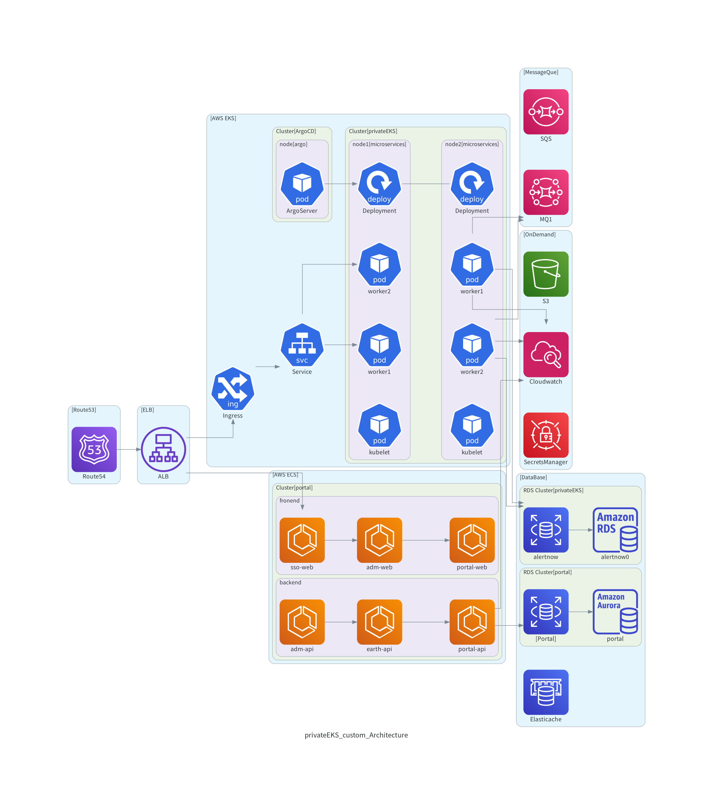

# privateEKS custom Project

## Architecture Overview

이 프로젝트는 하이브리드 컨테이너 아키텍처를 구현합니다:

- **인증 서비스**: Keycloak을 AWS ECS에서 운영하여 중앙 집중식 인증 관리
- **워크로드**: 마이크로서비스를 AWS EKS에서 운영하여 확장성과 관리 효율성 확보

### Key Components

- **ECS (Keycloak)**: 인증/인가 처리, 사용자 관리, SSO 제공
- **EKS (Workloads)**: 비즈니스 로직, API 서비스, 데이터 처리

## Documentation Structure

### 1. AWS Infrastructure

- [AWS 인프라 구성](1.AWS/README.md)

### 2. EKS Configuration

- [EKS 클러스터 구성](2.EKS/README.md)
  - [클러스터 생성](2.EKS/1.Cluster/README.md)
  - [노드 그룹 관리](2.EKS/2.Node/README.md)
  - [애드온 설정](2.EKS/3.AddOn/README.md)
  - [ArgoCD 설정](2.EKS/4.ArgoCD/README.md)
  - [Istio 설정](2.EKS/5.Istio/README.md)

### 3. Application Deployment

- [애플리케이션 배포](3.Application/README.md)
  - [Custom 애플리케이션](3.Application/custom/README.md)
  - [Portal 애플리케이션](3.Application/portal/README.md)

## diagrams

## Install

[install](./install.md)
