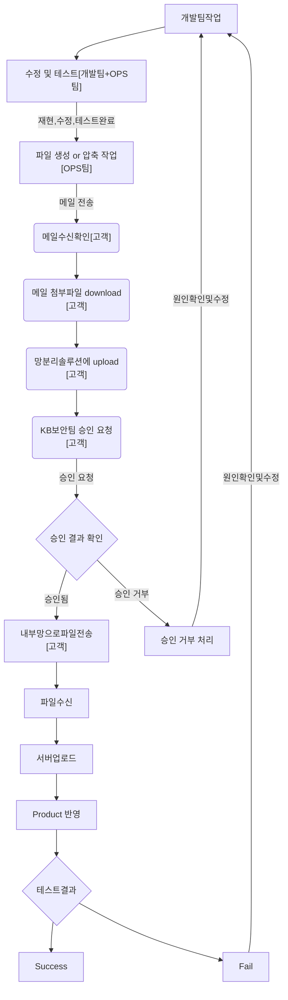

### 고객사[KB] 고려사항

파일을 kbds로 옮기는 과정은 아래와 같습니다.
지금처럼 ECR 이나 기타 등등 파일을 고객에게 전송 요청을 하게 되면 경험상 고객측의 지원을 받기가 어려울 수도 있습니다.
정식으로 계약을 하고 들어가는게 아닌 POC단계라서 잦은 요청을 고객이 적극적으로 지원 해주지는 않을 것 같습니다.
우리가 설치 파일을 압축해서 한번만 전달 하고 성공 한다면 이런 걱정은 필요 없겠지만
실제로 한번에 성공 할 확률은 거의 없다고 보시면 될 것 같습니다. 

1. bitbucket의 내용을 AWS-codecommit 으로 이전
2. Nexus 내부 구축 
 2.1 Nexus 를 고객사에 설치 할 수 있도록 가이드라인 필요
3. bitbucket url -> 을 codecommit & nexus url로 변경 작업 필요 

