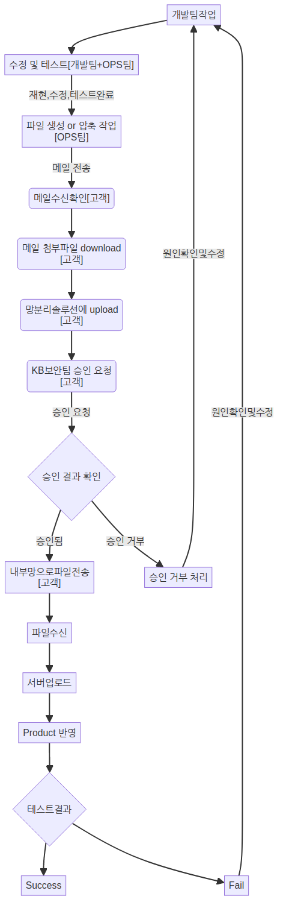
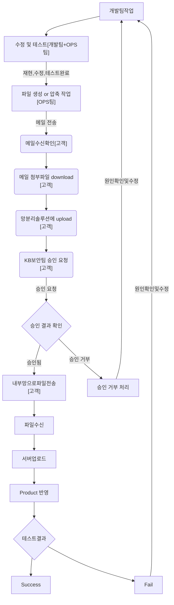

# 고객사[KB] 고려사항

### domain & certificate 
 - alertnow 같은 경우 도메인이 크게 중요하지 않았지만 portal 같은 경우 클라이언트에 도메인을 셋팅 하지 않을 경우 문제가 될 수 있다.
 - 각 env 별 도메인 설정은 아래와 같이 진행 하였다.
   - dev: aws private ca + acm + Portal sso 코드 내에 인증서 설치 작업진행
   - stg: aws private ca + acm + Portal sso 코드 내에 인증서 설치 작업진행
   - poc: 
       - domain: 고객의 도메인으로 진행 하였으며 poc계정의 route53 설정 완료 후 진행 하였다.
       - certificate: let's encrypt 를 사용하여 인증서 발급 후 진행 하였다.(고객이 작업 진행)

### 네트워크
고객사 네트워크의 특징은 모든 인터넷이 차단되어 있다.
작업자의 pc와 vpc 사이에 http proxy 서버를 두고 작업을 진행 하였다.
주요 특징은 아래와 같다.
 -  endpoint
    - IGW와 NAT가 없는 상태에서 AWS 내부에서 AWS용 API 호출이 불가능 하여 endpoint 를 사용하여 작업 진행이 필요하다.
 -  http proxy
      - 위의 ENDPOINT 설정을 했음에도 불구하고 AWS API 호출이 막히는 부분이 있었는데 \
          이 부분은 AWS Global Endpoint이다. 목록은 아래와 같다.
        - Amazon CloudFront
        - AWS Global Accelerator
        - AWS Identity and Access Management (IAM)
        - AWS Network Manager
        - AWS Organizations
        - Amazon Route 53
        - AWS Shield Advanced
        - AWS WAF Classic
    
    - 이 서비스들은 단일 글로벌 엔드포인트를 가지고 있으며, 리전을 지원하지 않습니다. 글로벌 엔드포인트를 사용하면 전 세계 어디서나 동일한 엔드포인트로 해당 서비스에 액세스할 수 있습니다.
    - 고객이 별도로 가이드를 해주지는 않았지만 콘솔용으로 제공된 squid 프록시를 재활용(?) 하여 문제를 해결 할 수 있었다.
      - bastion서버의 환경 변수에 아래와 같이 설정을 진행한다
      ```
      export http_proxy=http://squid.example.com:3128
      export https_proxy=http://squid.example.com:3128
      ```

### sticky session
- 포탈 sso 설치 후 로그인 시 무한 리다이렉션을 하면서 무한루프에 빠지는 케이스가 있었다.
- ecs나 pod를 2대 이상 셋팅 시 세션을 고정 시켜놓지 않으면 여기저기 왔다 갔다 하면서 지속적으로 리다이렉션을 한다.
- pod 나 task 의 갯수를 1개로 고정 하거나 alb의 sticky session 을 설정 하면 해결 된다.

### AMI : 준비 철저
> 고객사의 환경은 인터넷이 철저하게 배제된 환경에서 진행 하기 때문에 파일 인입의 기회가 제한 되어 있다. \
그래서 사전에 철저하게 시뮬레이션을 하고 필요한 파일을 가능하면 미리 준비 하여 진행 하는 것이 좋다.
dev 와  stg 환경에서 미리 테스트 하고 ec2를 AMI로 변환 하여 진행 하는 것을 추천 한다.

필요한 ami는 아래와 같다.
-  bastion
-  nexus
    -   사이즈를 줄여야 한다.
-  jenkins
    - 아예 안쓰는것을 추천한다.
    - AWS code deploy 를 사용하여 진행 하는 것을 추천 한다.
    - argocd의 기능 중 argo workflow 를 사용하여 진행 하는 것을 추천 한다.

### 환경변수화!
> 어플리케이션의 환경 변수화가 되지 않아 실제로 구축을 진행 시 난이도가 높았다.
> 코드에서 DB 접속 정보 등 환경 변수를 찾아 변경 하는 작업이 필요 하다.

### ALB로 NLB로 셋팅
- dev 나 stg 환경에서는 문제가 없었지만 poc 환경에서는 보안부서에서 방화벽 허용 신청을 해야 한다.
- alb 같은 경우 IP가 고정 되어 있지 않아 문제가 발생 할 수 있음으로 \
  운영 환경에서는 alb 상위에 NLB를 셋팅 하는 방법을 이용 해야 한다.

### 테라폼 안됨
- 테라폼으로 준비를 해도 실제 안에서 인터넷이 안되기 때문에 패키지 파일 다운이 되지 않아 테라폼은 사용 할 수 없다.
- 테라폼 클라우드를 이용 하여 설치를 시도 하였으나 테라폼 코드 자체가 퍼블릭 인터넷이 되는 환경
  기반으로 작성 되어 있어 프라이빗용으로 일일이 변경 해줘야 한다.
  배보다 배꼽이 더 큼으로 안쓰는 것을 추천

### 초반에 네임 스페이스 설계 
- 실제 dev 환경에서 준비 할시 k8s의 네임스페이스가 레포 1당 1개씩 셋팅 되어 있는데 \
  이렇게 하면 설치 진행이 매우 어려워 질 수 있다.
- 통합을 하던가 아니면 정확하게 정하고 가는게 필요해 보인다.
- 네임스페이스를 여러개로 나눠야 문제 없다고 인도인들이 주장하는데 근거 없는 이야기이다.

### 다이나모DB 초기 값이 있어야 함
- alertnow 구동 후 intgreation에서 오류가 발생 할 것이다. 
- dynamodb에서 초기 테이블을 생성 해줘야 한다.
- dev에 있는 dynamodb 테이블을 아래 정보로 복원 해줘야 한다.

```
S3PATH: s3://an-dev-dynamodb/AWSDynamoDB/01721981126985-360a67b6/data/
Table name: TLUK_ALERT_CONFIGURATION_MGMT
partitionkey: PK
sortkey: SK
Readmode & write mode: ON-DEMAND
Global secondary index name: IX_TLUK_ALERT_CONFIGURATION_MGMT_01
partitionkey: Attr06 (String)
sortkey: Attr07 (String)
projectedattributes: Include: SK, Attr01, PK, Attr03 
```

### 브라우저에서 보안 오류
- 한번에 연결이 안될때  개발자모드를 열어서 full url을 직접 입력하고 신뢰할수 있는 사이트 등록

### helm 이미지
> 인터넷이 되지 않는 환경이라 helm 설치 시 차트와 이미지를 모두 준비 해야 한다.
- chart
```bash
 helm pull eks/aws-load-balancer-controller
```

- image
  - 보통 values.yaml 파일에 이미지 정보가 있는데 이 부분을 수정 해야 한다.
  - repository 부분의 이미지를 받아서 private 레지스트리에 올리고 파일을 수정 해야 한다.
  - 번거롭기 때문에 압축파일로 미리 준비 해놓는것을 추천 한다.
   
```yaml
image:
  repository: public.ecr.aws/eks/aws-load-balancer-controller
  tag: v2.8.1
  pullPolicy: IfNotPresent
```


### ssh 사용 불가
- 고객사 환경 특성 상 80 /443 포트 외에 다른 포트(22) 사용이 불가능 하다.
- codecommit을 ssh를 못씀 -> 스퀴드 프록시가 80/443만 되기 때문이다.
- 대안으로 code commit의 https 주소를 사용하여 진행 하는 방법이 있다.

<details>
<summary>kb내부파일전송</summary>


파일을 kbds로 옮기는 과정은 아래와 같습니다.
지금처럼 ECR 이나 기타 등등 파일을 고객에게 전송 요청을 하게 되면 경험상 고객측의 지원을 받기가 어려울 수도 있습니다.
정식으로 계약을 하고 들어가는게 아닌 POC단계라서 잦은 요청을 고객이 적극적으로 지원 해주지는 않을 것 같습니다.
우리가 설치 파일을 압축해서 한번만 전달 하고 성공 한다면 이런 걱정은 필요 없겠지만
실제로 한번에 성공 할 확률은 거의 없다고 보시면 될 것 같습니다. 


1. bitbucket의 내용을 AWS-codecommit 으로 이전
2. Nexus 내부 구축 
 2.1 Nexus 를 고객사에 설치 할 수 있도록 가이드라인 필요
1. bitbucket url -> 을 codecommit & nexus url로 변경 작업 필요 



